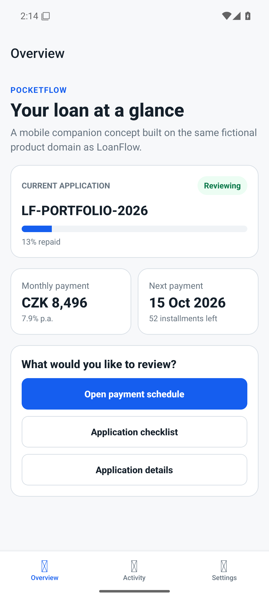
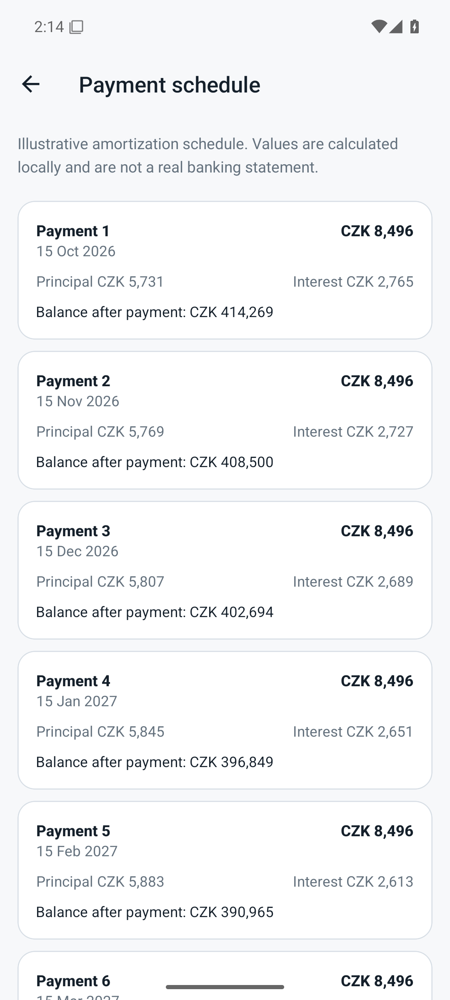
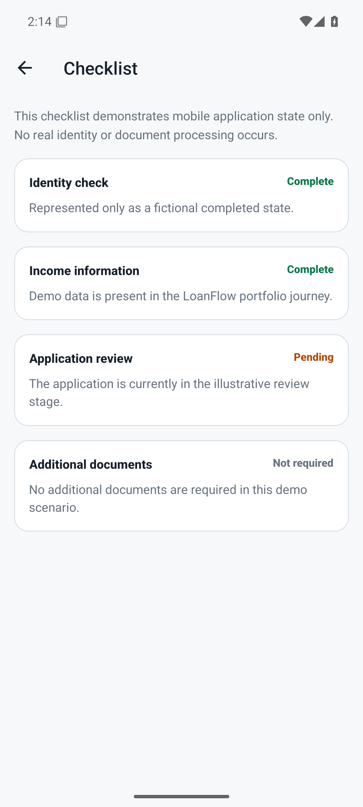
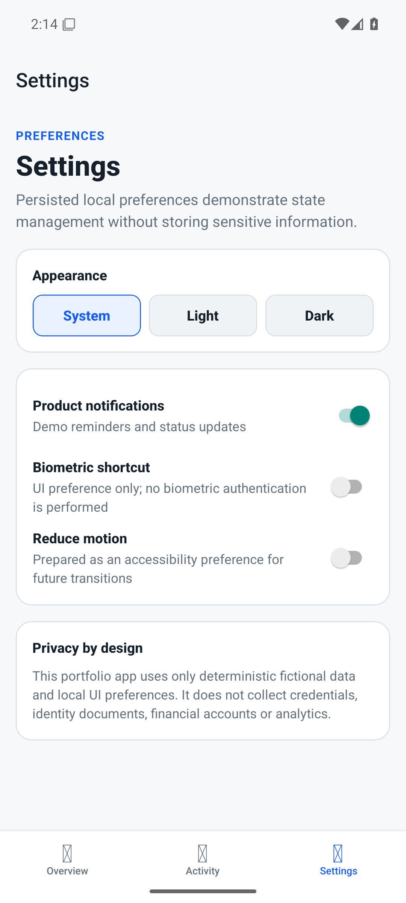
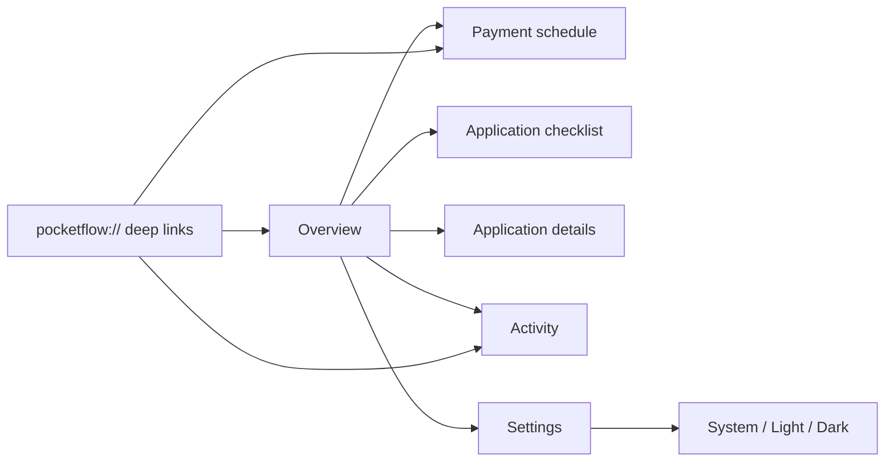
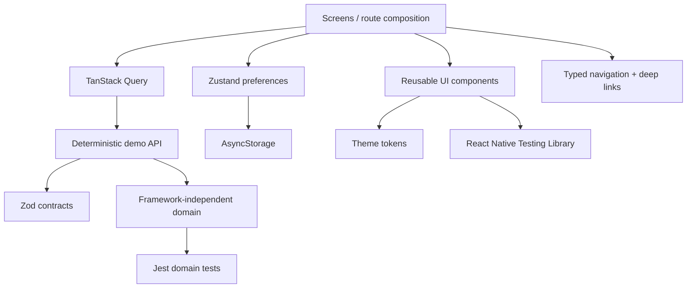

<div align="center">

# PocketFlow Mobile

**React Native + TypeScript mobile companion demonstrating product architecture, resilient state, accessibility, testing and CI/CD.**

[](https://github.com/Kamilla29/pocketflow-mobile/actions/workflows/ci.yml)


</div>

PocketFlow is the mobile companion in the fictional **LoanFlow** product family. The project is intentionally non-transactional: its purpose is to demonstrate mobile engineering decisions rather than simulate a real bank.

## Runtime screenshots

These screenshots were captured from a **standalone Android release APK** running on a Pixel 6 emulator (Android API 35). They are runtime captures of the application, not mockups or illustrative artwork.

| Overview | Payment schedule |
| --- | --- |
|  |  |

| Checklist | Settings |
| --- | --- |
|  |  |

## Recruiter quick scan

| Area | Evidence in this repository |
| --- | --- |
| Mobile development | React Native, Expo, typed stack + tabs, safe-area layouts, deep links |
| Type safety | TypeScript strict mode + Zod runtime contracts |
| State architecture | TanStack Query for remote-like state, Zustand + AsyncStorage for local preferences |
| Product resilience | loading, error, retry and pull-to-refresh states + app error boundary |
| Accessibility | semantic headings, progress/control roles and accessibility-aware preferences |
| Testing | Jest, React Native Testing Library and a Maestro device-level smoke flow |
| CI/CD | green GitHub Actions pipeline + portable Declarative Jenkinsfile |

## Product flow



The current journey includes:

1. **Overview** — application status, repayment progress and payment summary.
2. **Payment schedule** — amortization data generated by framework-independent domain logic.
3. **Application checklist** — validated fictional application requirements.
4. **Application details** — supporting product information.
5. **Activity** — deterministic application timeline.
6. **Settings** — persisted appearance and non-sensitive UI preferences.

Custom-scheme routes include `pocketflow://activity` and `pocketflow://payments`.

## Architecture



```text
src/
├── api/          # deterministic demo API + Zod contracts
├── components/   # reusable mobile UI primitives
├── domain/       # framework-independent types, formatting and loan math
├── navigation/   # typed stack, tabs and deep-link configuration
├── screens/      # route-level product composition
├── state/        # persisted local preferences
└── theme/        # system/light/dark theme resolution
```

The domain layer stays independent from React Native. **TanStack Query** owns remote-like application data, while **Zustand** owns local preferences, keeping server-state and client-state concerns separate and testable.

More detail: [`docs/architecture.md`](docs/architecture.md).

## Quality engineering

### Active GitHub Actions CI

Every push or pull request targeting `main` runs:

```text
npm ci
  ↓
Expo dependency alignment
  ↓
Expo Doctor
  ↓
TypeScript strict check
  ↓
Jest tests
  ↓
iOS Metro export smoke test
```

The portfolio-final increment was merged only after a green pull-request run, and the resulting `main` commit passed the same pipeline again.

### Jenkins Pipeline

A root-level [`Jenkinsfile`](Jenkinsfile) expresses the same quality gates using Declarative Pipeline syntax and a Node 22 Docker agent. GitHub Actions is the active hosted CI; Jenkins demonstrates portable Pipeline-as-Code rather than pretending a Jenkins controller is currently attached to the repository.

See [`docs/ci.md`](docs/ci.md).

### Mobile E2E

[`.maestro/smoke.yaml`](.maestro/smoke.yaml) defines a device/simulator smoke journey covering core navigation, payment schedule, checklist, application details, settings and a deep-link route.

It is deliberately documented as a device-level specification, not as a hosted-CI result. Prerequisites and commands are in [`docs/e2e.md`](docs/e2e.md).

## Automated coverage

Current deterministic coverage includes:

- amortized monthly payment calculation;
- payment schedule generation;
- repayment progress clamping;
- currency/date formatting;
- API schema rejection for invalid financial data;
- checklist contract validation;
- reusable status rendering;
- strict TypeScript compilation;
- Expo compatibility checks;
- Metro export smoke testing.

See [`docs/test-strategy.md`](docs/test-strategy.md).

## Run locally

Requirements: Node.js 22+ and an Expo-compatible local environment.

```bash
npm ci
npm start
```

Useful checks:

```bash
npm run typecheck
npm test
npm run doctor
npm run bundle
```

## Portfolio relationship

| Project | Role in the portfolio |
| --- | --- |
| [LoanFlow Web](https://github.com/Kamilla29/loanflow-web) | React/Nx web product flow |
| [QA Automation Lab](https://github.com/Kamilla29/qa-automation-lab) | Playwright quality engineering |
| **PocketFlow Mobile** | React Native mobile architecture |
| [Asteria Design System](https://github.com/Kamilla29/asteria-design-system) | reusable UI/design-system architecture |

Together they show web development, mobile development, automated testing and reusable UI architecture as distinct but connected engineering concerns.

## Portfolio-final status

The current codebase is treated as the **portfolio-final baseline**. The Android release build was also executed successfully to capture the runtime screenshots shown above. Future feature work should be driven by a concrete vacancy, interview task or learning objective instead of adding scope for its own sake.

See [`CHANGELOG.md`](CHANGELOG.md) for the final portfolio increment.

## Disclaimer

PocketFlow uses deterministic fictional data. It does not process real identities, banking credentials, credit decisions, payments or financial accounts and is not affiliated with any bank.
